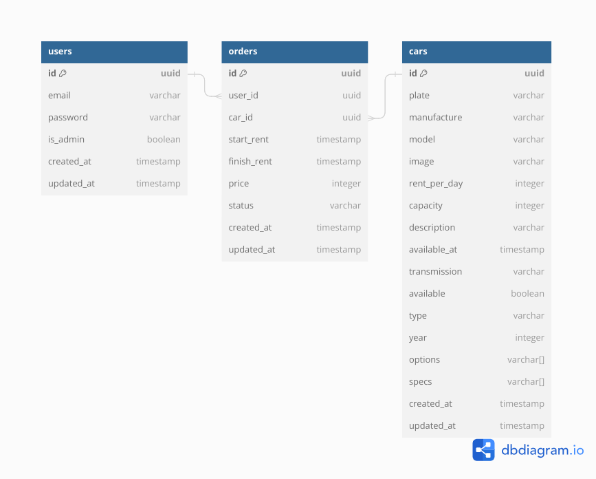

# Binar Car Rental

Binar Car Rental frontend and backend

## How to Run
- Execute command `npm i` to install required libraries
- Add or modify `.env` file according to database configuration (sample is given in `example.env`)
- Execute command `npm run dev` to run the server in development mode or `npm start` to build and run the server.

## How to Run (Docker)
- Execute command `docker-compose build` and `docker-compose up`

## Migration and Seed
- Add or modify `.env` file according to database configuration (sample is given in `example.env`)
- Execute command `npm run migrate` and `npm run seed`

## Entity-Relationship Diagram

## Endpoints

### Backend
#### Cars
| No | URI                                 | Method    | Description                              |
| -- | ----------------------------------- | --------- | ---------------------------------------- |
| 1  | /api/v1/cars                        | GET       | Retrieve cars                            |
| 2  | /api/v1/cars/:id                    | GET       | Retrieve car by id                       |
| 2  | /api/v1/cars/image/:filename        | GET       | Retrieve car image                       |
| 3  | /api/v1/cars                        | POST      | Create car                               |
| 3  | /cars/image                         | POST      | Upload car image                         |
| 4  | /api/v1/cars/:id                    | PUT       | Update car                               |
| 5  | /api/v1/cars/:id                    | DELETE    | Delete car                               |

### Frontend
| No | URI              | Description                              |
| -- | ---------------- | ---------------------------------------- |
| 1  | /                | Landing page                             |
| 2  | /cars            | Find car                                 |

#### Orders
| No | URI                     | Method    | Description                              |
| -- | ----------------------- | --------- | ---------------------------------------- |
| 1  | /api/v1/orders          | GET       | Retrieve orders                          |

#### Dos
| No | URI                     | Description                              |
| -- | ----------------------- | ---------------------------------------- |
| 1  | /docs                   | Swagger docs                             |